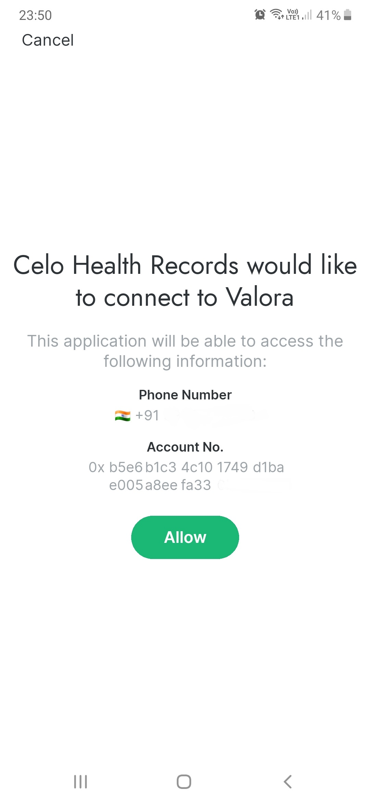
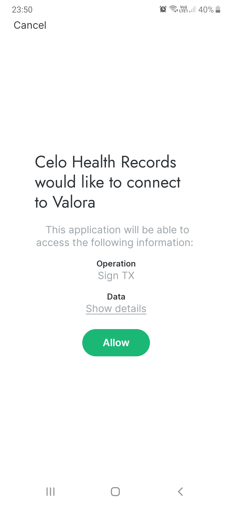

# Celo Health Records
Celo Health Records is a simple dapp to help the users update and store their health records using a smart contract to ensure immutability and security.
After successful login using the celo alfajores wallet, the user would have options to either view the records or update the records. In case of updating the records, any change in the parameters would trigger the celo wallet and ask the user if they want to sign this particular transaction and since it is a change in the variable, the user would be asked to enter the pin in order to permit the particular transaction. After updating, the user can view the health records to find the updated changes reflected back. Another feature that is in works to be added is the buying of an insurance premium based on the health records of the user using the celo wallet. 

# ScreenShots

## Requirements
- [Node.js](https://nodejs.org/en/)
- [Yarn package manager](https://yarnpkg.com/)
- [Truffle](https://www.trufflesuite.com/truffle)
- [Expo](https://docs.expo.io/get-started/installation/)

